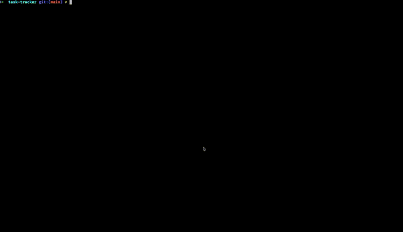

# Task Tracker CLI

<p>
  
  
  
</p>

A lightweight command-line task tracker written in Go. Create, update, delete, and organize tasks with status tracking (`todo`, `in-progress`, `done`) — all from your terminal. Data persists locally in a JSON file with zero external dependencies.

Based on the [**Task Tracker**](https://roadmap.sh/projects/task-tracker) project from [roadmap.sh](https://roadmap.sh).

---

## Table of Contents

- [Features](#features)
- [Demo](#demo)
- [Installation](#installation)
- [Usage](#usage)
- [Examples](#examples)
- [Data Storage](#data-storage)
- [Project Structure](#project-structure)
- [License](#license)

---

## Features

- Create, update, delete, and view tasks
- Track task status (`todo`, `in-progress`, `done`)
- Filter and list tasks by status
- Get a single task by ID
- Interactive REPL mode
- Persistent JSON storage
- Lightweight CLI — no database required
- Cross-platform
- Zero external dependencies

---

## Demo



---

## Installation

### Prerequisites

- [Go](https://go.dev/dl/) 1.23 or later

### Steps

```bash
# Clone the repository
git clone https://github.com/yourusername/task-tracker.git
cd task-tracker

# Build the binary
go build -o task-cli

# Verify it works
./task-cli --help
```

You can also run directly without building:

```bash
go run . add "Hello, world!"
```

---

## Usage

| Command | Example | Description |
|---|---|---|
| `add` | `task-cli add "Buy groceries"` | Create a new task with status `todo` |
| `update` | `task-cli update 1 "Buy groceries and cook dinner"` | Change a task's description |
| `delete` | `task-cli delete 1` | Remove a task permanently |
| `mark-in-progress` | `task-cli mark-in-progress 1` | Mark a task as `in-progress` |
| `mark-done` | `task-cli mark-done 1` | Mark a task as `done` |
| `list` | `task-cli list` | List all tasks |
| `list` (filtered) | `task-cli list done` | List tasks filtered by status |
| `get` | `task-cli get 1` | Display a single task by ID |
| `--help` / `-h` | `task-cli --help` | Show usage information |
| `-i` / `--interactive` | `task-cli -i` | Start interactive REPL mode |

---

## Examples

### Typical workflow

```bash
# Add a few tasks
./task-cli add "Learn Go basics"
./task-cli add "Build a CLI project"
./task-cli add "Write documentation"

# See everything
./task-cli list

# Start working on the second task
./task-cli mark-in-progress 2

# Finish the first task
./task-cli mark-done 1

# Check progress
./task-cli list
```

### Interactive REPL mode

```bash
task-cli -i
task> add "Buy milk"
Task added successfully (ID: 1).
task> list
ID: 1, Description: Buy milk, Status: todo, ...
task> mark-done 1
Task marked as done successfully.
task> get 1
ID: 1, Description: Buy milk, Status: done, ...
task> quit
```

### Sample output

```text
ID: 1, Description: Learn Go basics, Status: done, Created At: 2026-06-30 10:15:00, Updated At: 2026-06-30 10:20:00
ID: 2, Description: Build a CLI project, Status: in-progress, Created At: 2026-06-30 10:15:00, Updated At: 2026-06-30 10:21:00
ID: 3, Description: Write documentation, Status: todo, Created At: 2026-06-30 10:15:00, Updated At: 2026-06-30 10:22:00
```

### Filtering by status

```bash
task-cli list done          # only completed tasks
task-cli list in-progress   # only active tasks
task-cli list todo          # only unstarted tasks
```

### Error handling

```bash
task-cli update 999 "nope"          # "task not found"
task-cli add                        # "Usage: task add <description>"
task-cli unknown                    # "Unknown command: unknown"
```

---

## Data Storage

Tasks are saved to a `tasks.json` file in the project directory. The file is created automatically when you add your first task.

```json
[
  {
    "id": 1,
    "description": "Learn Go basics",
    "status": "done",
    "created_at": "2026-06-30T10:15:00Z",
    "updated_at": "2026-06-30T10:20:00Z"
  },
  {
    "id": 2,
    "description": "Build a CLI project",
    "status": "in-progress",
    "created_at": "2026-06-30T10:15:00Z",
    "updated_at": "2026-06-30T10:21:00Z"
  }
]
```

You can edit `tasks.json` manually, but the CLI will overwrite it on the next write operation.

---

## Project Structure

| File | Responsibility |
|---|---|
| `main.go` | Entry point — dispatches to CLI or REPL mode |
| `utils.go` | CLI utilities — usage help, command dispatch, REPL loop, input parsing |
| `task.go` | `Task` struct, `Status` type, status constants, colored `String()` output |
| `storage.go` | Reads and writes `tasks.json`, generates sequential IDs |
| `commands.go` | Business logic for `add`, `update`, `delete`, `mark`, `list`, `get` |
| `go.mod` | Go module definition |

---

## License

MIT
